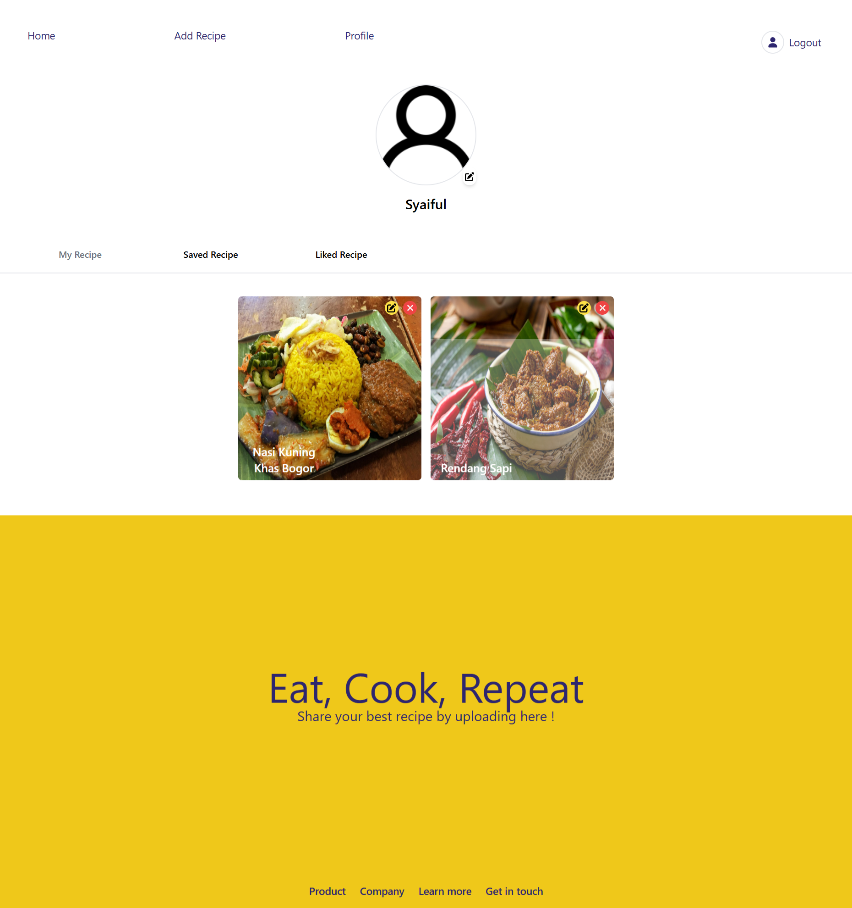

# Recipe

<p align="center">
  
</p>

## Table of Content

- [About The Project](#about-the-project)
- [Usage](#usage)
- [Installation](#installation)
- [Documentation](#documentation)
- [Visit](#visit)
- [Other References](#other-references)

## About The Project
Recipe is a website for exploring various food recipes. Users can also share their own recipes for others to see. Additionally, users can mark recipes they like and save them to view later.

## Usage
This website is built using [Vite + React](https://vitejs.dev/), the next-js framework. The web design and responsiveness are achieved with [Tailwind](https://tailwindcss.com/). For API management, the website utilizes the [Axios Library](https://axios-http.com/) to ensure neatness and efficiency. The site employs [react-redux](https://react-redux.js.org/) for state management, making the state flow cleaner, more efficient, and easier to control. For routing, the website uses the [react-router-dom](https://reactrouter.com/en/main) library to simplify the routing process. The website uses the `cookies-next` library to store tokens used for authentication in cookies.

## Installation

Steps to install and set up this project on your local machine.

1. Clone the repository:
    ```bash
    git clone https://github.com/nizuma666/recipe-next-js.git
    ```
2. Install dependencies:
    ```bash
    npm install
    ```
    or
    ```bash
    yarn install
    ```

## Usage

- Run the following command to start the project:
    ```bash
    npm run dev
    ```
    or
    ```bash
    yarn dev
    ```

## Documentation
### 1. Landing Page
This is the first page visited when accessing the site.


### 2. Login
The login page requires an email and password to access features like adding, liking, and saving recipes, as well as visiting profiles. The login button will be enabled once all form fields are filled out.


### 3. Register
The registration page requires several mandatory fields to be filled out. The register button will be enabled once all fields are completed.


### 4. Profile
This page displays a list of recipes created, liked, and saved by the user. The created recipes list includes options to edit and delete recipes, while the liked and saved lists include options to remove recipes from those lists.


### 5. Add & Edit Recipe
This page contains the form needed to add a recipe. The same form is used to edit existing recipes.


### 6. Detail Recipe
This page provides detailed information about a specific recipe. It includes options to like and save the recipe, but users must be logged in to use these features.


## Visit
If you are interested in seeing the website directly, please visit [this link](https://recipe-alpha-vert.vercel.app/).

## Other References
- :rocket: [HTML](https://www.duniailkom.com/tutorial-belajar-html-dan-index-artikel-html/)
- :rocket: [CSS](https://www.duniailkom.com/tutorial-belajar-css-dan-index-artikel-css/)
- :rocket: [Javascript](https://www.duniailkom.com/tutorial-belajar-javascript-dan-index-artikel-javascript/)
- 🚀 [Cookie-Next](https://www.npmjs.com/package/cookies-next)
