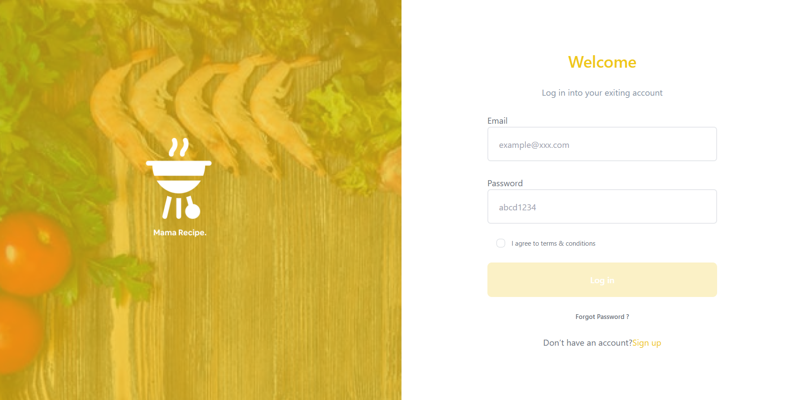
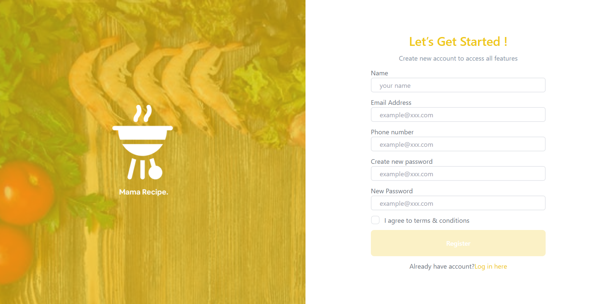
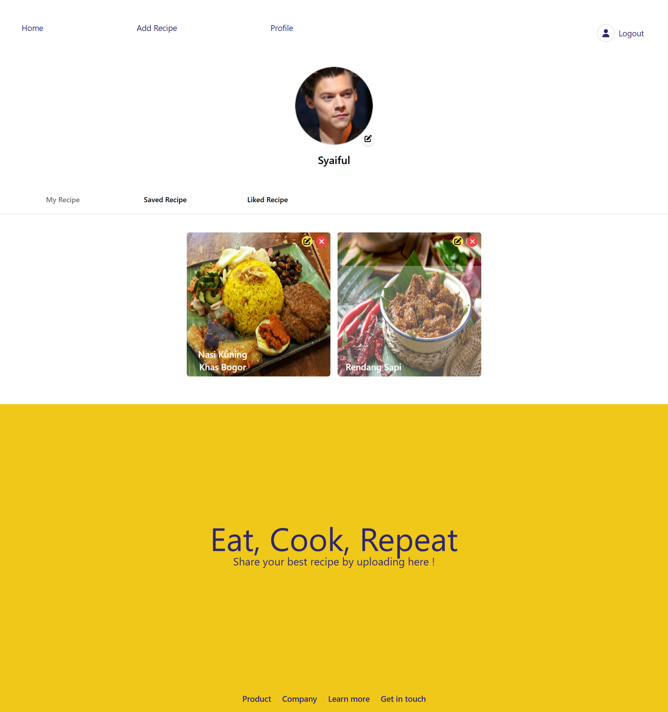
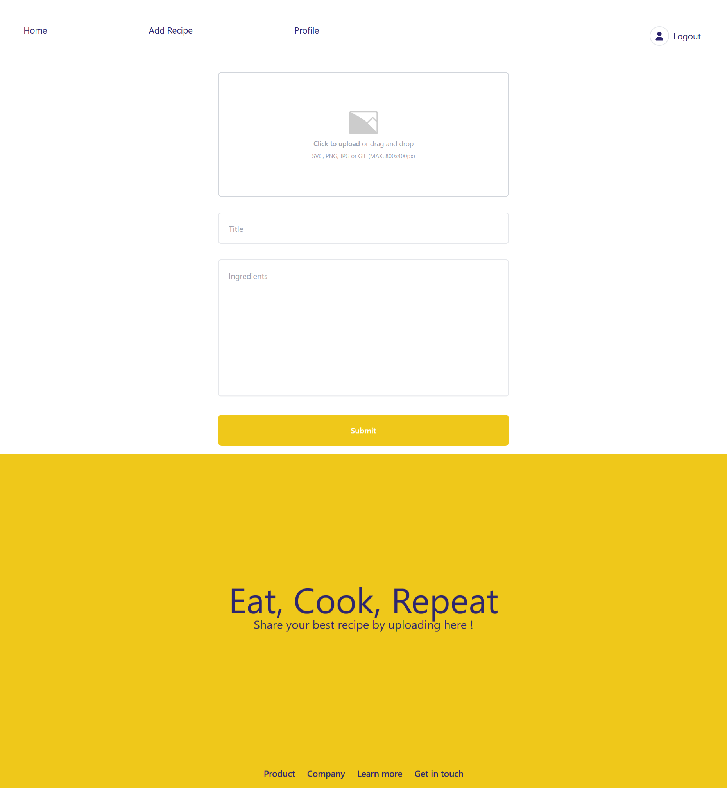
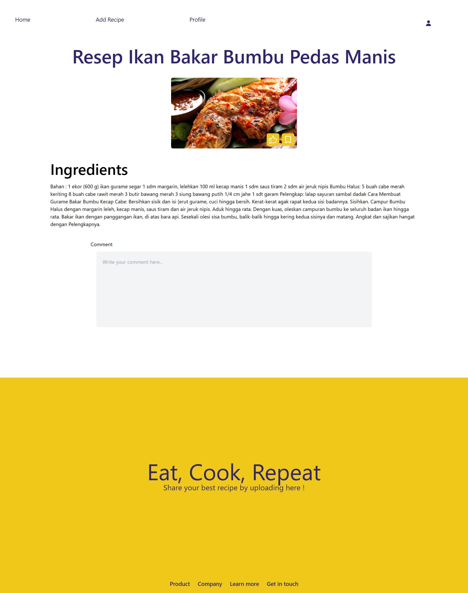

# Recipe

<p align="center">
  
</p>

## Table of Content

- [About The Project](#about-the-project)
- [Usage](#usage)
- [Installation](#installation)
- [Project Structure](project-structure)
- [Documentation](#documentation)
- [Features](#features)
- [Tester Account](#tester-account)
- [Visit](#visit)
- [Back-End Recipe](#back-end-recipe)
- [Contributing](#contributing)
- [License](#license)
- [Contact](#contact)
- [Related Project](#related-project)

## About The Project
Recipe is a website for exploring various food recipes. Users can also share their own recipes for others to see. Additionally, users can mark recipes they like and save them to view later.

## Usage
This website is built using [Vite + React](https://vitejs.dev/), the next-js framework. The web design and responsiveness are achieved with [Tailwind](https://tailwindcss.com/). For API management, the website utilizes the [Axios Library](https://axios-http.com/) to ensure neatness and efficiency. The site employs [react-redux](https://react-redux.js.org/) for state management, making the state flow cleaner, more efficient, and easier to control. For routing, the website uses the [react-router-dom](https://reactrouter.com/en/main) library to simplify the routing process. The website uses the `cookies-next` library to store tokens used for authentication in cookies.

## Installation

Steps to install and set up this project on your local machine.

1. Clone the repository:
    ```bash
    git clone https://github.com/nizuma666/recipe-next-js.git
    ```
2. Install dependencies:
    ```bash
    npm install
    ```
    or
    ```bash
    yarn install
    ```

## Usage

- Run the following command to start the project:
    ```bash
    npm run dev
    ```
    or
    ```bash
    yarn dev
    ```
## Project Structure
```bash
├───components
│   ├───base
│   └───module
├───configs
│   └───redux
│       ├───actions
│       └───reducers
├───pages
│   ├───addrecipe
│   ├───auth
│   │   ├───login
│   │   └───register
│   ├───detailrecipe
│   ├───editrecipe
│   ├───profile
│   ├───resultsearch
│   └───trycode
├───public
│   ├───assets
│   └───doc-readme-reipe
├───services
└───styles
```

## Documentation

| Page            | Description                                                                                                         | Image                                                                  |
|-----------------|---------------------------------------------------------------------------------------------------------------------|------------------------------------------------------------------------|
| Landing Page    | This is the first page visited when accessing the site.                                                             |               |
| Login           | The login page requires an email and password to access features like adding, liking, and saving recipes, as well as visiting profiles. The login button will be enabled once all form fields are filled out. |                             |
| Register        | The registration page requires several mandatory fields to be filled out. The register button will be enabled once all fields are completed. |                       |
| Profile         | This page displays a list of recipes created, liked, and saved by the user. The created recipes list includes options to edit and delete recipes, while the liked and saved lists include options to remove recipes from those lists. |                         |
| Add & Edit Recipe | This page contains the form needed to add a recipe. The same form is used to edit existing recipes.                |         |
| Detail Recipe   | This page provides detailed information about a specific recipe. It includes options to like and save the recipe, but users must be logged in to use these features. |              |

## Features
- Using Next.js for project structure
- Implementing Client-Side Rendering (CSR) and Server-Side Rendering (SSR) for page rendering
- API management with Axios
- State management using Redux
- Managing JWT tokens in cookies
- Implementing Protected Routes for specific pages
- Create, edit, and delete recipes
- Like and save recipes

## Tester Account
Please use the following account to try out all the features in this project
- Email: syaiful@gmail.com
- Pass: abcd1234

## Visit
If you are interested in seeing the website directly, please visit [this link](https://recipe-alpha-vert.vercel.app/).

## Back-End Recipe
The back-end system for this project was created by [muhammad risano](https://github.com/muhammadrisano) using express-js. If you want to see more about this back-end project, please visit [back-end recipe](https://github.com/nizuma666/pijar-mama-recipe)

## Contributing
Contributions are what make the open source community such an amazing place to learn, inspire, and create. Any contributions you make are **greatly appreciated**.

If you have a suggestion that would make this better, please fork the repo and create a pull request. You can also simply open an issue with the tag "enhancement".
Don't forget to give the project a star! Thanks again!

1. Fork the Project
2. Create your Feature Branch (`git checkout -b feature/Feature`)
3. Commit your Changes (`git commit -m 'Add some Feature'`)
4. Push to the Branch (`git push origin feature/Feature`)
5. Open a Pull Request

## License
Distributed undet MIT License. see [LICENSE](https://github.com/nizuma666/recipe-next-js/blob/master/LICENSE) for more information.

## Contact
I am very open to criticism and suggestions from all of you, please contact syaifullohismail123@gmail.com email or [My Linkedin](https://www.linkedin.com/in/syaifulloh-ismail/) to give feedback.
